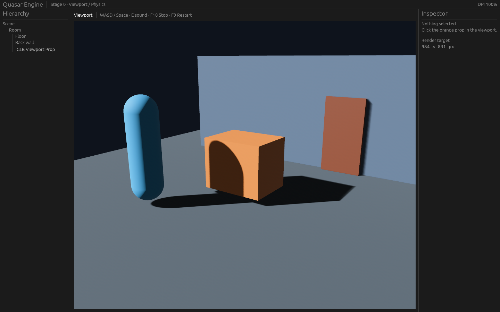

# Quasar Engine

Quasar Engine — ранний эксперимент с собственным 3D-движком и редактором. Проект только начинает развиваться: сейчас это технический прототип Stage 0, а не готовый игровой движок. Архитектура, интерфейс и набор возможностей будут меняться.

> © 2026 melonqww. Все права защищены. Проект не распространяется по лицензии Open Source. Публикация предназначена для ознакомления; любое использование за пределами возможностей, предоставляемых GitHub для публичных репозиториев, требует отдельного письменного разрешения правообладателя.

## Текущий прототип

Это снимок реально запущенного прототипа: окно редактора, viewport с тестовой сценой, иерархия объектов и инспектор. Это исходная техническая оболочка, а не финальный дизайн интерфейса.

Сейчас прототип проверяет базовый путь от сцены в редакторе до отдельного Player. В него входят viewport и выбор объекта, панели иерархии и инспектора, тестовая 3D-сцена, базовое управление персонажем, коллизия со стеной, взаимодействие с дверью и звуком, а также работа Player с версионированным снимком проекта. Эти функции подтверждены в рамках ранней технической проверки и не означают, что рабочий процесс полноценного редактора уже готов.

## Куда развивается проект

Задуман редактор с вкладками для сцен, кода и библиотеки ассетов. Вкладка кода должна объединять скрипты проекта и сохранять изменения автоматически; ассеты должны подключаться через общую библиотеку. Основной интерфейс планируется в двух уровнях: **Basic** для частых задач и **Advanced** для подробных настроек того же проекта. Эти направления пока являются планом и прототипированием, а не реализованными функциями.

Дальнейшая цель — сделать создание и настройку 3D-сцен удобнее: развивать работу со сценами и ресурсами, инструменты редактирования, диагностику и самостоятельную сборку игр. Приоритеты и конкретный состав первой версии ещё уточняются.

## Статус

Проект находится на самой ранней альфа-стадии. Он предназначен для постепенной проверки технической основы и продуктовых идей; стабильность форматов, готовность к созданию игр и совместимость между версиями пока не гарантируются.

## История проекта

- [Публичный Devlog](DEVLOG.md) — важные этапы и выводы.
- [Публичный Changelog](CHANGELOG.md) — крупные изменения проекта.
