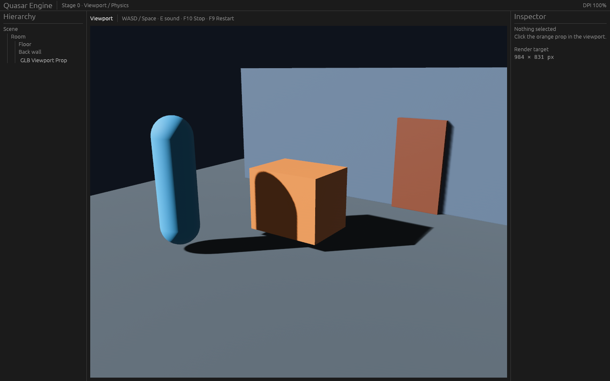

# Quasar Engine

Quasar Engine — ранний эксперимент с собственным 3D-движком и редактором. Сейчас есть технический прототип Editor/Player, постоянный документ сцены и начальная библиотека ассетов; это всё ещё не готовый игровой движок. Архитектура, интерфейс и набор возможностей будут меняться.

> © 2026 melonqww. Все права защищены. Проект не распространяется по лицензии Open Source. Публикация предназначена для ознакомления; любое использование за пределами возможностей, предоставляемых GitHub для публичных репозиториев, требует отдельного письменного разрешения правообладателя.

## Текущий прототип

Это снимок реально запущенного прототипа: окно редактора, viewport с тестовой сценой, иерархия объектов и инспектор. Это исходная техническая оболочка, а не финальный дизайн интерфейса.

Снимок Stage 0 выше остаётся изображением первоначального прототипа. Текущий технический срез включает document mode с иерархией, инспектором, transform controls, сохранением/Undo/Redo, Player preview и ранней библиотекой моделей, текстур, звука и Lua-скриптов. Сцена использует типизированные компоненты камеры, контроллера, коллайдера, rigid body и аудио. Вкладка Code редактирует проектные Lua-скрипты с автосохранением; Player исполняет ограниченный `on_interact` callback. Постоянное аудио и Editor/MCP Play/Stop реализованы как ранние срезы и ещё требуют ручной приёмки.

## Куда развивается проект

Задуман редактор с вкладками для сцен, кода и библиотеки ассетов. Вкладка кода объединяет скрипты проекта и автоматически сохраняет изменения; ассеты подключаются через общую библиотеку. Основной интерфейс планируется в двух уровнях: **Basic** для частых задач и **Advanced** для подробных настроек того же проекта. Направление интерфейса продолжает меняться.

Начата визуальная база по выбранному концепту: серые панели с янтарным акцентом, компактные действия, вертикальные инструменты и Console. Scene/Assets/Code доступны в document mode; Basic/Advanced пока переключает технические подробности. Advisor и более подробная обратная связь Play остаются будущей работой.

Дальнейшая цель — сделать создание и настройку 3D-сцен удобнее: развивать работу со сценами и ресурсами, инструменты редактирования, диагностику и самостоятельную сборку игр. MCP развивается вместе с редактором: он читает и изменяет сцены, управляет библиотекой и скриптами, а также запускает Play через общую сессию Editor. Текущий игровой API ограничен; динамическая/кинематическая физика и авторская Lua-дверь — следующий срез этапа 4.

## Статус

Проект находится на самой ранней альфа-стадии. Он предназначен для постепенной проверки технической основы и продуктовых идей; стабильность форматов, готовность к созданию игр и совместимость между версиями пока не гарантируются.

## История проекта

- [Публичный Devlog](DEVLOG.md) — важные этапы и выводы.
- [Публичный Changelog](CHANGELOG.md) — крупные изменения проекта.
